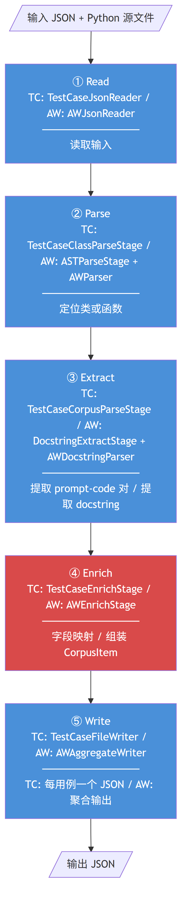
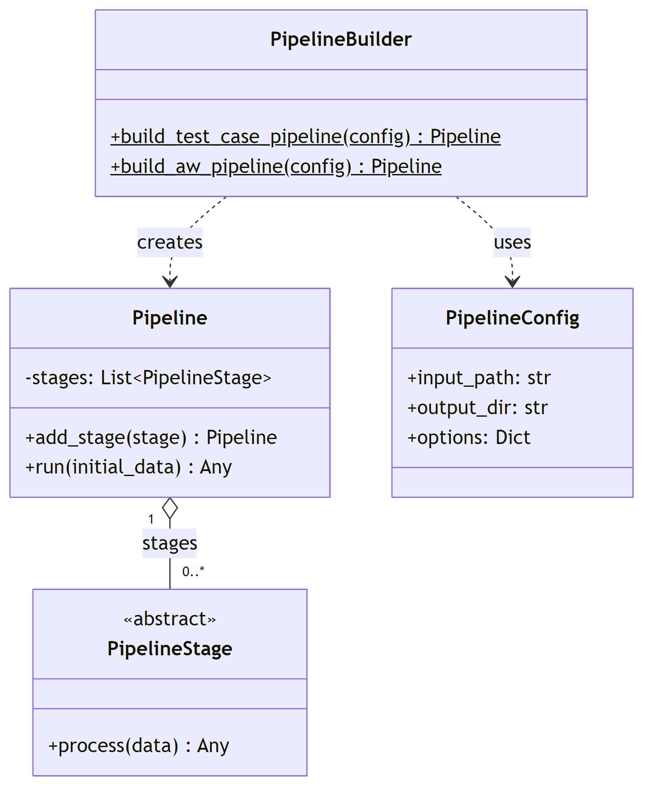
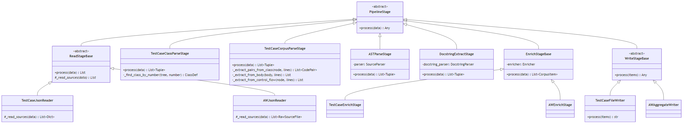
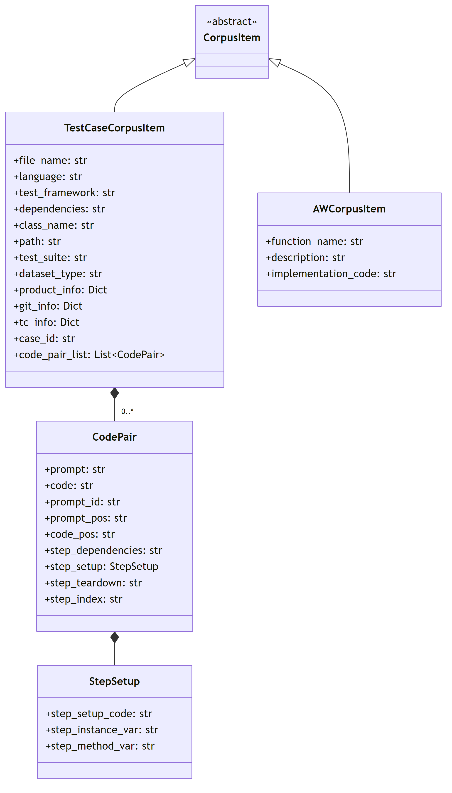
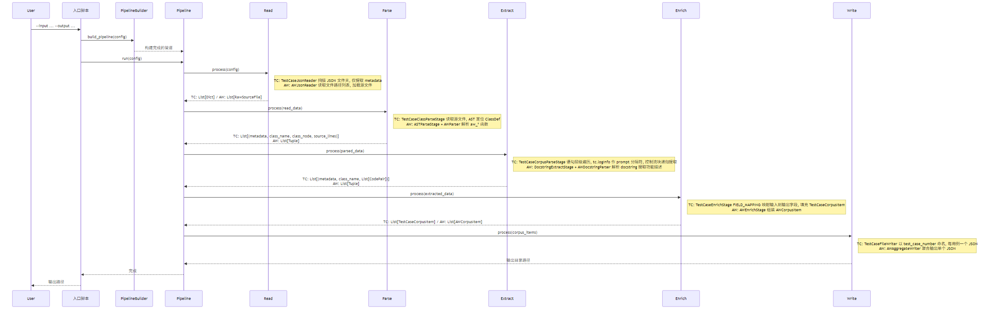

# DataWash - 语料清洗工具

DataWash 是一个基于数据流管道架构的语料清洗工具，支持测试用例语料和 AW（Action Word）语料的清洗。

## 功能概述

1. **测试用例语料清洗**：输入多个测试用例 JSON 文件，从 Python 源码中提取 `tc.logInfo(...)` 作为 prompt、相邻 logInfo 之间的代码作为 code，输出增强后的 JSON 文件（每个用例一个）
2. **AW 语料清洗**：输入包含文件路径的 JSON，提取 AW 函数的功能描述和实现代码，输出聚合 JSON

---

## 清洗流程



**关键步骤**：

**测试用例清洗**：
1. **读取**：扫描输入文件夹中的所有 JSON 文件，提取 metadata（不含源码）
2. **类解析**：根据 metadata 中的 `file_full_path` 读取源文件，AST 定位与 `test_case_number` 匹配的 `ClassDef` 节点
3. **语料提取**：以语句层级遍历类方法体，将 `tc.logInfo(...)` 中的字符串作为 prompt，到下一个同级 `tc.logInfo` 之间的代码作为 code，控制流块（if/else/for/while/try）内的 `tc.logInfo` 递归提取为独立对
4. **增强**：通过 `FIELD_MAPPING` 将输入字段映射为输出字段，支持点号嵌套（如 `case_info.test_case_number` → `tc_info.test_case_number`）
5. **写入**：每个测试用例输出一个 JSON 文件，以 `test_case_number` 命名

**AW 清洗**：
1. **读取**：加载 JSON 中的文件路径列表，读取所有 .py 源文件
2. **解析**：AST 定位所有 `def aw_*` 函数定义
3. **提取**：从 docstring 解析函数功能描述
4. **增强**：组装 AWCorpusItem
5. **写入**：聚合输出单个 JSON

---

## 4+1 视图架构设计

### 1. 逻辑视图（Logical View）— UML 类图

#### 核心管道与阶段



#### 阶段继承体系



#### 数据模型



---

### 2. 进程视图（Process View）— 数据流管道

```
测试用例:  JSON 文件夹 ──→ [Reader] ──→ [ClassParse] ──→ [CorpusParse] ──→ [Enrich] ──→ [Writer] ──→ 每个 JSON
AW:        JSON 文件   ──→ [Reader] ──→ [ASTParse]   ──→ [DocExtract]  ──→ [Enrich] ──→ [Writer] ──→ 单个 JSON
```

**管道阶段说明**：

| 阶段 | 测试用例实现 | AW 实现 | 职责 |
|------|------------|---------|------|
| Read | TestCaseJsonReader | AWJsonReader | 读取输入：TC 仅读 metadata / AW 读源文件 |
| Parse | TestCaseClassParseStage | ASTParseStage + AWParser | TC 定位 ClassDef / AW 解析 aw_* 函数 |
| Extract | TestCaseCorpusParseStage | DocstringExtractStage + AWDocstringParser | TC 提取 prompt-code 对 / AW 提取 docstring |
| Enrich | TestCaseEnrichStage | AWEnrichStage | TC 字段映射 / AW 组装 CorpusItem |
| Write | TestCaseFileWriter | AWAggregateWriter | TC 每用例一个文件 / AW 聚合输出 |

**测试用例管道数据流**：

```
List[Dict]                                          ← TestCaseJsonReader 输出
  ↓
List[(metadata, class_name, class_node, source_lines)]  ← TestCaseClassParseStage 输出
  ↓
List[(metadata, class_name, List[CodePair])]        ← TestCaseCorpusParseStage 输出
  ↓
List[TestCaseCorpusItem]                            ← TestCaseEnrichStage 输出
  ↓
output_dir (多个 JSON 文件)                          ← TestCaseFileWriter 输出
```

---

### 3. 开发视图（Development View）— 项目结构

```
DataWash/
├── README.md
├── input/                                    # 输入 JSON 文件夹
├── output/                                   # 输出目录
├── docs/
│   └── images/                               # 架构图
├── src/
│   └── datawash/
│       ├── __init__.py
│       ├── testcase_wash.py                  # 测试用例清洗入口
│       ├── aw_wash.py                        # AW 清洗入口
│       ├── config/
│       │   └── pipeline_config.py            # PipelineConfig(input_path, output_dir, options)
│       ├── models/
│       │   ├── raw_source.py                 # RawSourceFile (AW 管道使用)
│       │   ├── parsed_entity.py              # ParsedEntity, StructuredEntity
│       │   ├── corpus_item.py                # CodePair, StepSetup, TestCaseCorpusItem, AWCorpusItem
│       │   └── docstring_structure.py        # DocstringStructure (AW 管道使用)
│       ├── pipeline/
│       │   ├── pipeline.py                   # Pipeline 编排器
│       │   ├── pipeline_builder.py           # PipelineBuilder 工厂
│       │   └── pipeline_stage.py             # PipelineStage ABC
│       ├── stages/
│       │   ├── read/
│       │   │   ├── read_stage_base.py        # ReadStageBase (Template Method)
│       │   │   ├── test_case_json_reader.py  # 仅读 metadata
│       │   │   └── aw_json_reader.py
│       │   ├── parse/
│       │   │   ├── ast_parse_stage.py        # ASTParseStage (AW 管道)
│       │   │   ├── test_case_class_parse_stage.py   # 定位 ClassDef
│       │   │   └── test_case_corpus_parse_stage.py  # 提取 prompt-code 对
│       │   ├── extract/
│       │   │   └── docstring_extract_stage.py        # DocstringExtractStage (AW 管道)
│       │   ├── enrich/
│       │   │   ├── enrich_stage_base.py
│       │   │   ├── test_case_enrich_stage.py
│       │   │   └── aw_enrich_stage.py
│       │   └── write/
│       │       ├── write_stage_base.py
│       │       ├── test_case_file_writer.py
│       │       └── aw_aggregate_writer.py
│       ├── parsers/
│       │   ├── source_parser.py              # SourceParser ABC (AW 管道)
│       │   ├── docstring_parser.py           # DocstringParser ABC (AW 管道)
│       │   ├── test_case/
│       │   │   ├── test_case_parser.py
│       │   │   └── test_case_docstring_parser.py
│       │   └── aw/
│       │       ├── aw_parser.py
│       │       └── aw_docstring_parser.py
│       ├── enrichers/
│       │   ├── enricher.py                   # Enricher ABC
│       │   ├── test_case_enricher.py         # FIELD_MAPPING 字段映射
│       │   └── aw_enricher.py
│       └── utils/
│           ├── ast_utils.py
│           ├── file_utils.py
│           └── docstring_utils.py
└── test_case.py                              # 测试用例模板
```

---

### 4. 物理视图（Physical View）— 部署与运行

```
运行环境:
  CLI 命令行 ──→ Pipeline 引擎 ──→ 文件系统

输入源:
  测试用例: 输入文件夹（多个 JSON + Python 源文件路径在 JSON 中指定）
  AW:       单个 JSON（含文件路径列表）+ Python 源文件

输出:
  测试用例: 每个 test_case_number 一个 JSON 文件
  AW:       aw_corpus.json
```

**运行方式**：

```bash
# 测试用例清洗
python -m datawash.testcase_wash --input ./input --output ./output

# AW 语料清洗
python -m datawash.aw_wash --input ./aw_input.json --output ./aw_output
```

---

### 5. 场景视图（Scenarios）— 时序图



**测试用例与 AW 的差异仅在阶段策略实现**：

| 阶段 | 测试用例 | AW |
|------|---------|-----|
| Read | TestCaseJsonReader：扫描 JSON 文件夹，仅提取 metadata | AWJsonReader：读取文件路径列表，加载源文件 |
| Parse | TestCaseClassParseStage：读取源文件，AST 定位 ClassDef | ASTParseStage + AWParser：解析 aw_* 函数 |
| Extract | TestCaseCorpusParseStage：语句层级遍历，tc.logInfo 作 prompt 分隔符，控制流块递归提取 | DocstringExtractStage + AWDocstringParser：解析 docstring 提取功能描述 |
| Enrich | TestCaseEnrichStage：FIELD_MAPPING 映射输入→输出字段 | AWEnrichStage：组装 AWCorpusItem |
| Write | TestCaseFileWriter：每用例一个 JSON | AWAggregateWriter：聚合输出单个 JSON |

**语料提取算法说明**（TestCaseCorpusParseStage）：
- 以 **语句层级** 遍历方法体（非行级别），保证控制流块完整
- 遇到 `tc.logInfo(msg)` → 保存上一对 prompt-code，开始新 pair，msg 作为 prompt
- 遇到含 `tc.logInfo` 的控制流块（if/else/for/while/try/with）→ 整个块加入当前 code，并 **递归提取** 块内的 prompt-code 对
- 遇到普通语句 → 扩展当前 code 范围
- `prompt_pos` 和 `code_pos` 为闭区间行号，格式 `[start, end]`
- 支持 `tc.logInfo("字符串")` 和 `tc.logInfo(f"格式化{变量}")` 两种形式

---

## 设计模式应用

| 模式 | 应用位置 | 解决的问题 |
|------|---------|-----------|
| **Strategy** | SourceParser, DocstringParser, Enricher | 不同语料类型需要不同解析/增强逻辑，通过策略注入实现可替换 |
| **Template Method** | ReadStageBase, WriteStageBase | 读写阶段共享框架，子类仅实现 `_read_sources` / `_write_output` |
| **Pipeline** | Pipeline 编排器 | 清洗流程是多步变换，阶段解耦后可灵活组合、增删、重排 |
| **Builder** | PipelineBuilder | 管道构建涉及多阶段和配置，Builder 封装标准组合方式 |

## SOLID 原则遵循

| 原则 | 体现 |
|------|------|
| **SRP** | 每个类单一职责：Reader 只读、ClassParse 只定位类、CorpusParse 只提取对、Enricher 只映射、Writer 只写 |
| **OCP** | 新增语料类型只需添加新的 Stage/Enricher/Reader/Writer 子类，无需修改已有代码 |
| **LSP** | 所有 PipelineStage 子类可互换；SourceParser/DocstringParser/Enricher 策略可互换 |
| **ISP** | 接口窄化：SourceParser 只管解析、DocstringParser 只管 docstring、Enricher 只管增强 |
| **DIP** | ASTParseStage 依赖 SourceParser 抽象；EnrichStageBase 依赖 Enricher 抽象；Pipeline 依赖 PipelineStage 抽象 |
