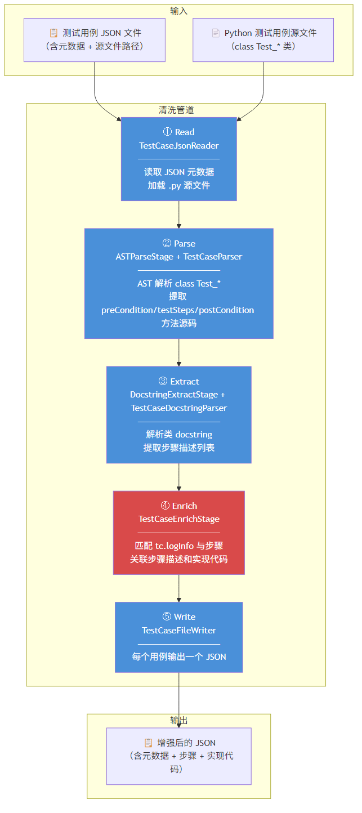
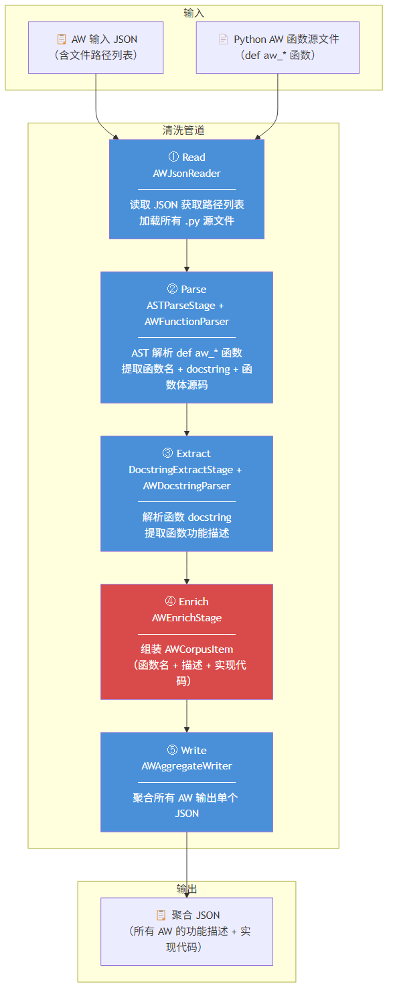
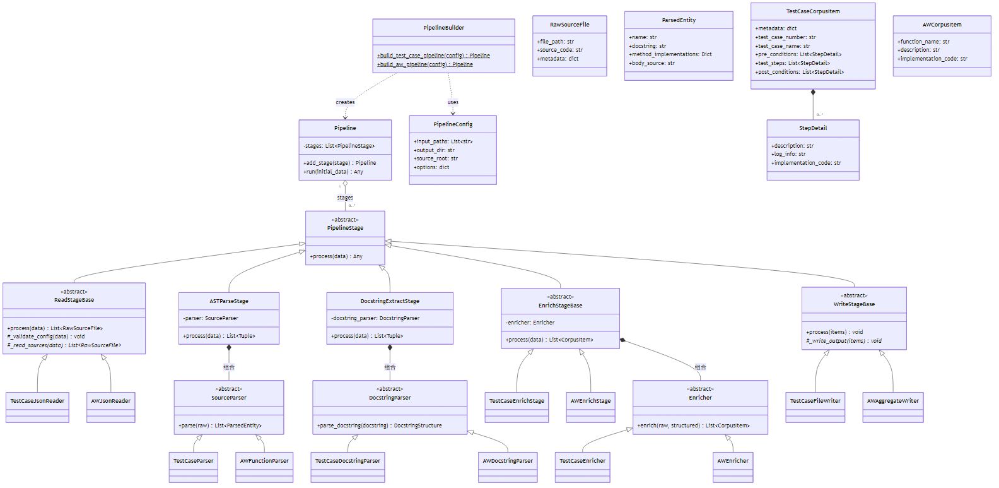

# DataWash - 语料清洗工具

DataWash 是一个基于数据流管道架构的语料清洗工具，支持测试用例语料和 AW（Action Word）语料的清洗。

## 功能概述

1. **测试用例语料清洗**：输入多个测试用例 JSON 文件，提取测试步骤及其实现代码，输出增强后的 JSON 文件
2. **AW 语料清洗**：输入包含文件路径的 JSON，提取 AW 函数的功能描述和实现代码，输出聚合 JSON

---

## 清洗流程

### 测试用例语料清洗流程



**关键步骤**：
1. **读取**：加载多个 JSON（含元数据 + 源文件路径），同时读取对应的 .py 源文件
2. **解析**：使用 Python `ast` 模块解析源文件，定位 `class Test_*` 类定义，提取 `preCondition`/`testSteps`/`postCondition` 方法的源码
3. **提取**：从类 docstring 中解析出 TestCaseNumber、TestCaseName、步骤描述列表
4. **增强**：将 `tc.logInfo(...)` 调用作为步骤分隔符，把步骤描述与对应的实现代码关联起来，生成 `StepDetail`
5. **写入**：每个测试用例输出一个 JSON 文件

### AW 语料清洗流程



**关键步骤**：
1. **读取**：加载单个 JSON，获取文件路径列表，读取所有 .py 源文件
2. **解析**：使用 `ast` 模块定位所有 `def aw_*` 函数定义，提取函数名、docstring 和函数体源码
3. **提取**：从函数 docstring 中解析出 `函数功能描述:` 后的文本
4. **增强**：将函数名、功能描述和实现代码组装为 `AWCorpusItem`
5. **写入**：所有 AW 信息聚合输出到一个 JSON 文件

---

## 4+1 视图架构设计

### 1. 逻辑视图（Logical View）— UML 类图



**设计要点**：
- `PipelineStage` 是所有管道阶段的抽象基类，5 个子类分别对应 Read/Parse/Extract/Enrich/Write 阶段
- `ASTParseStage` 通过组合 `SourceParser` 策略实现不同格式的 AST 解析
- `DocstringExtractStage` 通过组合 `DocstringParser` 策略实现不同 docstring 格式的解析
- `EnrichStageBase` 通过组合 `Enricher` 策略实现不同业务的数据增强
- `Pipeline` 持有有序的 `PipelineStage` 列表，顺序执行各阶段

**继承关系**：

```
PipelineStage (ABC)
├── ReadStageBase (ABC) ←── TestCaseJsonReader / AWJsonReader
├── ASTParseStage        ←── 组合 SourceParser (Strategy)
├── DocstringExtractStage ←── 组合 DocstringParser (Strategy)
├── EnrichStageBase (ABC) ←── TestCaseEnrichStage / AWEnrichStage
└── WriteStageBase (ABC)  ←── TestCaseFileWriter / AWAggregateWriter

SourceParser (ABC) ←── TestCaseParser / AWFunctionParser
DocstringParser (ABC) ←── TestCaseDocstringParser / AWDocstringParser
Enricher (ABC) ←── TestCaseEnricher / AWEnricher
```

**数据模型**：

```
RawSourceFile (file_path, source_code, metadata)
    ↓ Parse
ParsedEntity (name, docstring, method_implementations, body_source)
    ↓ Extract
StructuredEntity (name, doc_structure, method_implementations, body_source)
    ↓ Enrich
TestCaseCorpusItem (metadata, test_case_number, ..., pre_conditions/test_steps/post_conditions: List[StepDetail])
AWCorpusItem (function_name, description, implementation_code)
```

---

### 2. 进程视图（Process View）— 数据流管道

```
测试用例清洗管道:
  多个 JSON ──→ [TestCaseJsonReader] ──→ [ASTParseStage + TestCaseParser]
              ──→ [DocstringExtractStage + TestCaseDocstringParser]
              ──→ [TestCaseEnrichStage] ──→ [TestCaseFileWriter] ──→ 每个用例一个 JSON

AW 清洗管道:
  单个 JSON ──→ [AWJsonReader] ──→ [ASTParseStage + AWFunctionParser]
            ──→ [DocstringExtractStage + AWDocstringParser]
            ──→ [AWEnrichStage] ──→ [AWAggregateWriter] ──→ 聚合 JSON
```

**管道阶段说明**：

| 阶段 | 职责 | 输入 | 输出 |
|------|------|------|------|
| Read | 读取 JSON 配置并加载源文件 | JSON 配置 | `List[RawSourceFile]` |
| Parse | AST 解析源文件 | `List[RawSourceFile]` | `List[Tuple[RawSourceFile, ParsedEntity]]` |
| Extract | 从 docstring 提取结构化信息 | 解析结果 | `List[Tuple[RawSourceFile, StructuredEntity]]` |
| Enrich | 合并元数据与提取结果 | 结构化数据 | `List[CorpusItem]` |
| Write | 序列化输出 | `List[CorpusItem]` | JSON 文件 |

---

### 3. 开发视图（Development View）— 项目结构

```
DataWash/
├── README.md
├── docs/
│   └── images/                          # 架构图
├── src/
│   └── datawash/
│       ├── __init__.py
│       ├── main.py                          # CLI 入口
│       ├── config/
│       │   └── pipeline_config.py           # PipelineConfig 数据类
│       ├── models/
│       │   ├── raw_source.py                # RawSourceFile
│       │   ├── parsed_entity.py             # ParsedEntity, StructuredEntity
│       │   ├── corpus_item.py               # CorpusItem, TestCaseCorpusItem, AWCorpusItem, StepDetail
│       │   └── docstring_structure.py       # DocstringStructure, TestCaseDocStructure, AWDocStructure
│       ├── pipeline/
│       │   ├── pipeline.py                  # Pipeline 编排器
│       │   ├── pipeline_builder.py          # PipelineBuilder 工厂
│       │   └── pipeline_stage.py            # PipelineStage ABC
│       ├── stages/
│       │   ├── read/
│       │   │   ├── read_stage_base.py       # ReadStageBase (Template Method)
│       │   │   ├── test_case_json_reader.py
│       │   │   └── aw_json_reader.py
│       │   ├── parse/
│       │   │   └── ast_parse_stage.py       # ASTParseStage (组合 SourceParser)
│       │   ├── extract/
│       │   │   └── docstring_extract_stage.py
│       │   ├── enrich/
│       │   │   ├── enrich_stage_base.py
│       │   │   ├── test_case_enrich_stage.py
│       │   │   └── aw_enrich_stage.py
│       │   └── write/
│       │       ├── write_stage_base.py      # WriteStageBase (Template Method)
│       │       ├── test_case_file_writer.py
│       │       └── aw_aggregate_writer.py
│       ├── parsers/
│       │   ├── source_parser.py             # SourceParser ABC (Strategy)
│       │   ├── docstring_parser.py          # DocstringParser ABC (Strategy)
│       │   ├── test_case/
│       │   │   ├── test_case_parser.py      # TestCaseParser
│       │   │   └── test_case_docstring_parser.py
│       │   └── aw/
│       │       ├── aw_parser.py             # AWFunctionParser
│       │       └── aw_docstring_parser.py
│       ├── enrichers/
│       │   ├── enricher.py                  # Enricher ABC
│       │   ├── test_case_enricher.py
│       │   └── aw_enricher.py
│       └── utils/
│           ├── ast_utils.py                 # AST 工具函数
│           ├── file_utils.py                # 文件 I/O 工具
│           └── docstring_utils.py           # docstring 文本处理工具
└── tests/
    ├── fixtures/
    │   ├── source/                          # 测试用例和 AW 源文件
    │   ├── tc_input/                        # 测试用例输入 JSON
    │   └── tc_expected_output/              # 测试用例期望输出 JSON
    ├── aw_input.json                        # AW 输入 JSON
    ├── aw_expected_output.json              # AW 期望输出 JSON
    └── test_*.py
```

---

### 4. 物理视图（Physical View）— 部署与运行

```
运行环境:
  CLI 命令行 ──→ Pipeline 引擎 ──→ 文件系统

输入源:
  测试用例 JSON / AW 输入 JSON / Python 源文件

输出:
  测试用例 JSON（每个用例一个） / aw_corpus.json
```

**运行方式**：

```bash
# 测试用例清洗
python -m datawash --mode testcase --input ./tc_input.json --output ./tc_output/ --source-root /repo/src

# AW 语料清洗
python -m datawash --mode aw --input ./aw_input.json --output ./aw_output/ --source-root /repo/src
```

---

### 5. 场景视图（Scenarios）— 用例

#### 场景一：测试用例语料清洗

```
User ──→ main.py: --mode testcase --input ...
main.py ──→ PipelineBuilder: build_test_case_pipeline(config)
PipelineBuilder ──→ Pipeline: 构建完成的管道
main.py ──→ Pipeline: run(config)

Pipeline ──→ TestCaseJsonReader: process(config)
  → List[RawSourceFile]    (读取 JSON 元数据 + 加载 .py 源文件)

Pipeline ──→ ASTParseStage(TestCaseParser): process(raw_files)
  → List[(RawSourceFile, ParsedEntity)]    (AST 解析 class Test_*，提取方法体源码)

Pipeline ──→ DocstringExtractStage(TestCaseDocstringParser): process(parsed_data)
  → List[(RawSourceFile, StructuredEntity)]    (解析 docstring 提取步骤描述)

Pipeline ──→ TestCaseEnrichStage: process(structured_data)
  → List[TestCaseCorpusItem]    (匹配 tc.logInfo 与步骤，合并元数据)

Pipeline ──→ TestCaseFileWriter: process(corpus_items)
  → 写入多个 JSON 文件
```

#### 场景二：AW 语料清洗

```
User ──→ main.py: --mode aw --input ...
main.py ──→ PipelineBuilder: build_aw_pipeline(config)
PipelineBuilder ──→ Pipeline: 构建完成的管道
main.py ──→ Pipeline: run(config)

Pipeline ──→ AWJsonReader: process(config)
  → List[RawSourceFile]    (读取 JSON 获取路径 + 加载 .py 源文件)

Pipeline ──→ ASTParseStage(AWFunctionParser): process(raw_files)
  → List[(RawSourceFile, ParsedEntity)]    (AST 解析 def aw_*，提取函数体源码)

Pipeline ──→ DocstringExtractStage(AWDocstringParser): process(parsed_data)
  → List[(RawSourceFile, StructuredEntity)]    (解析 docstring 提取函数功能描述)

Pipeline ──→ AWEnrichStage: process(structured_data)
  → List[AWCorpusItem]    (组装 function_name + description + code)

Pipeline ──→ AWAggregateWriter: process(corpus_items)
  → 写入单个聚合 JSON
```

---

## 设计模式应用

| 模式 | 应用位置 | 解决的问题 |
|------|---------|-----------|
| **Strategy** | SourceParser, DocstringParser | 不同源文件格式需要不同解析逻辑，通过策略注入实现可替换 |
| **Template Method** | ReadStageBase, WriteStageBase | 读写阶段共享校验/日志框架，子类仅实现差异化的钩子方法 |
| **Pipeline** | Pipeline 编排器 | 清洗流程是多步变换，阶段解耦后可灵活组合、增删、重排 |
| **Builder** | PipelineBuilder | 管道构建涉及多阶段和配置，Builder 封装标准组合方式 |
| **Factory Method** | Enricher 创建 CorpusItem | 不同业务线产出不同输出类型，创建逻辑与业务逻辑共置 |

## SOLID 原则遵循

| 原则 | 体现 |
|------|------|
| **SRP** | 每个类单一职责：Reader 只读、Parser 只解析、Enricher 只合并、Writer 只写 |
| **OCP** | 新增语料类型只需添加新的 Parser/Enricher/Reader/Writer 子类，无需修改已有代码 |
| **LSP** | 所有 PipelineStage 子类可互换；SourceParser/DocstringParser 策略可互换 |
| **ISP** | 接口窄化：SourceParser 只管解析、DocstringParser 只管 docstring、Enricher 只管增强 |
| **DIP** | ASTParseStage 依赖 SourceParser 抽象而非具体 TestCaseParser；Pipeline 依赖 PipelineStage 抽象 |
